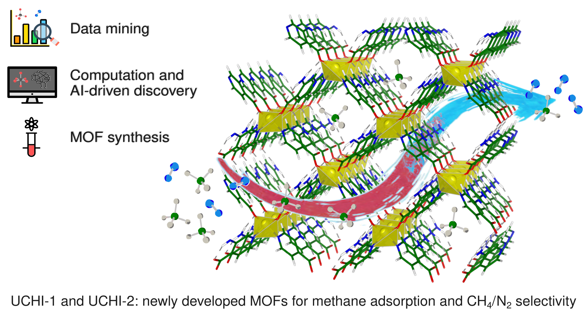

# End-to-end discovery of MOFs for ambient CH₄ adsorption

<p align="center">
  
</p>

This repository is related to the scientific article "End-to-end discovery of MOFs for ambient CH₄ adsorption" published on the Journal of American Chemical Society and it includes:

 * XGBoost trained model for methane adsorption prediction of MOF materials at atmospheric condition
 * Database of MOFs used after training
 * Novel MOF structures


## 📜 Citation

```bibtex
@article{10.1021/jacs.6c07479,
title = {End-To-End Discovery of MOFs for Ambient CH4 Adsorption},
author = {Darù, Andrea and Ling, Jianheng and Wang, Xiaoliang and Magdalenski, Julian S. and Xie, Haomiao and Farha, Omar K. and Delferro, Massimiliano and Anderson, John S. and Gagliardi, Laura},
journal = {J. Am. Chem. Soc.},
volume={},
number={},
pages={},
year = {2026},
doi = {10.1021/jacs.6c07479},
url = {https://doi.org/10.1021/jacs.6c07479},
}
```
